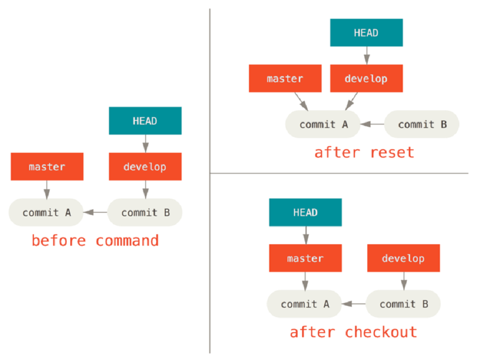
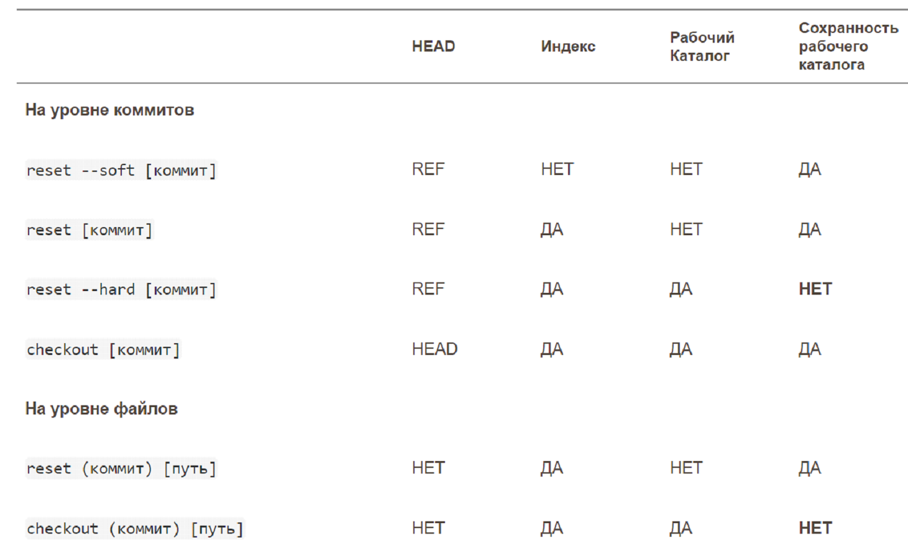

= git checkout & reset

== git checkout

*_git checkout -b <new branch name>_*  –-  чтобы создать ветвь и одновременно переключиться на неё.

== git reset

*_git reset_*  --  переносит HEAD на *[указанный]* коммит

[cols=2]

|===

| git reset --soft HEAD~ 
| не обновляет staged

| git reset [--mixed] HEAD~
| обновляет staged pass:[ ] не обновляет рабочую папку

| git reset --hard HEAD~
| обновляет ВСЕ pass:[ ] старая информация теряется!! (однако можно восстановить)

|===

== Разница *_checkout_*  и *_resert_*

. checkout не трогает файлы из рабочей директории, в которых уже есть изменения (информация сохраняется, а не теряется, как при reset)

. reset перемещает ветку на нужный коммит, а checkout перемещает лишь HEAD:

