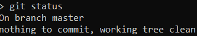
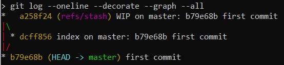
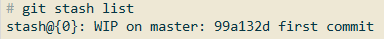
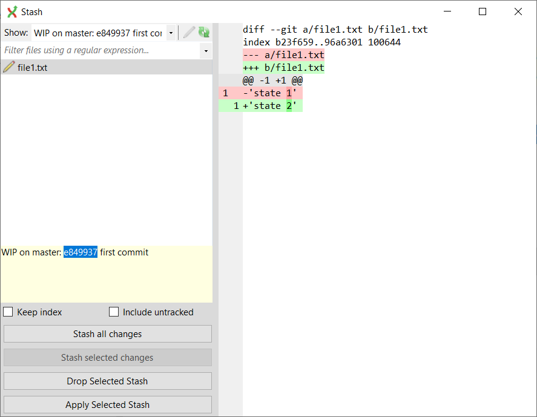

= Припрятывание в git

== Желательные цели

=== Обозначения стадий выполнения

* (-)  --  еще не внесено в план
* (+)  --  внесено в план
* (v)  --  выполнено в bat
* (!)  --  работает
* (?)  --  вроде работает, но есть вопросы
* (~)  --  есть подпункты разной стадии
* (*)  --  не обязательно
* (F)  --  задача снята, выполнять принципиально не надо

_Если все подпункты имеют одинаковую стадию выполнения, то содрежращему их (под)пункту присваивается та же стадия_

_Например:_

. (+)  --  (...)
.. (+)  --  (...) 
.. (+)  --  (...)

=== Цели со стадиями

. (~)  --  припрятывание
.. (!)  --  выполнить припрятывание из разных веток
.. (!)  --  посмотреть, как "коллекция" припрятываний выглядит в

... (!)  --  git status pass:[ ] 
             
... (!)  --  git log pass:[ ] 

... (!)  --  git stash list pass:[ ] 

... (!)  --  Git Extensions (*_сделать паузу на этом моменте в bat_*) pass:[ ] 

.. (!)  --  найти способ увидеть, какие именно изменения хранятся в каждом припрятыванеии (картинка выше из пред п.)
            
            
. (~)  --  восстановдение припрятывания 
.. (!)  --  из того же места
.. (!)  --  из другого места (та же ветка, другая ветка и т.п.)
.. (!)  --  получить конфликт при восстановлении
.. (*)  --  исправить конфликт

== Описание тестов

=== Смысловая разница двух тестов 1 и 2 ниже (stage_test1.bat и stage_test2.bat)

. _припрятанная "коллекцця" в *stage_test1.bat* возвращается в свою ветвь каждая_
. _припрятанная "коллекция" в *stage_test2.bat* возвращается в другую ветвь каждая_

=== Смысловая разница двух ветвей в первом тесте stage_test1.bat

. _в главной ветви *stage_test1.bat* файл добавляется в stage_
. _в ветви branch_2 *stage_test1.bat* файл *НЕ* добавляется в stage_ 

=== План для stage_test1.bat

. создать директорию для репозитория
. инициализировать репозиторий
. создать файл (file1.txt) в главной ветке
. сделать первый комммит (иначе ругается stash)
. редактировать file1.txt 
. положить в stage
. припрятать коммит из главной ветви
.. посмотреть, как выглядит массив припрятанных "коммитов" (данных) через 
... status
... log
... Extensions (**_сделать паузу на этом моменте в bat_**)
.. вернуть припрятанный "коммит" (данные) из главной веткив неё же

=== План для stage_test2.bat

. создать директорию для репозитория
. инициализировать репозиторий
. создать файл (file1.txt) в главной ветке
. припрятать коммит из главной ветви
.. посмотреть, как выглядит массив припрятанных "коммитов" (данных) через 
... status
... log
... Extensions (**_сделать паузу на этом моменте в bat_**)
. создать ветку branch_2
. перебранчеваться из главной ветки в branch_2
. создать файл (file2.txt) в ветке branch_2
. припрятать "коммит" (данные) из новой ветки branch_2
.. посмотреть, как выглядит массив припрятанных "коммитов" (данных) через 
... status
... log
... Extensions (**_сделать паузу на этом моменте в bat_**)
.. найти данные из branch_2
. вернуть и закоммитить припрятанный "коммит" (данные) из главной  ветки в branch_2
. перебранчеваться из branch_2 в главную ветвь
. вернуть и закоммитить припрятанный "коммит" (данные) из branch_2 в главную ветвь

== Текущие проблемы и вопросы

=== Обозначения стадий проблем и вопросов

* (-)  --  не решено
* (!)  --  решено

=== Проблемы и вопросы со стадиями

. (!)  --  не отображаются цветные комментарии в консоли
. (!)  --  "The system cannot find the batch label specified - log" pass:[ ]
           //вероятно, именно из-за этоо не работает п.1
. (-)  --  Возвращает ли stash данные из stage, и, если да, куда: в stage или только рабочую папку? pass:[ ]
           По умолчанию из stage кладет в рабочую директорию
           Для того, чтобы вернуть в stage, использовать команду с ключом: *_git stash apply --index_*
