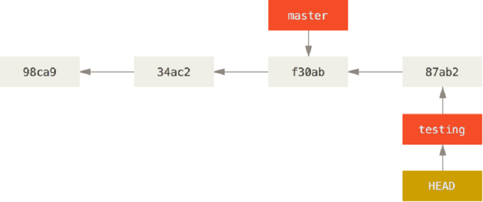

= Ветвление в git

Коммиты образуют ориентированный граф-дерево (без орциклов) с корнем в первом коммите. В случае, когда происходит merge, идет ветвление, но не цикл! (потому что граф ориентирован)

При создании новой ветки возникает новый указатель на текущий коммит. Поэтому операции с ветками достаточно дешевые с точки зрения времени.

*HEAD*  -– указатель на текущую ветвь.

При переключении ветвей происходит 2 вещи:

. Переключается указатель HEAD
. Меняеются файлы в рабочей директории.

Чтобы лучше понять, как устроен коммит изнутри, надо читать первую главу книги, но на понимание ветвления это особо не играет роли.

== https://git-scm.com/book/ru/v2/%D0%9E%D1%81%D0%BD%D0%BE%D0%B2%D1%8B-Git-%D0%97%D0%B0%D0%BF%D0%B8%D1%81%D1%8C-%D0%B8%D0%B7%D0%BC%D0%B5%D0%BD%D0%B5%D0%BD%D0%B8%D0%B9-%D0%B2-%D1%80%D0%B5%D0%BF%D0%BE%D0%B7%D0%B8%D1%82%D0%BE%D1%80%D0%B8%D0%B9[2.2 Основы Git - Запись изменений в репозиторий]

[cols=2]

|===

| Untracked 
| файлы, за которыми гит не следит (не путать с gitignore!)

| Unmodified 
| файлы, по тем или иным причинам лежащие в рабочей директории и совпадающие с последней своей версией, за которой гит следит (staged или закоммиченные)

| Modified 
| то же, только не совпадающие со своей последней отслеживаемой версией

|===

Stage = commit index. Из рабочей директории (working directory) файлы попадают в stage. Из stage – в коммит. Коммит хранится на компе. ~Из коммита – на сервер (push?)

== Слияние веток:

Чтобы слить одну ветвь (В) в другую (А), достаточно просто переклчиться на старую (А). Это удобно.

=== *MERGE:*

Пусть есть дерево коммитов с двумя ветвями: b1 и b2. При merge b2 -> b1:

. Ищется послдений общий коммит
. Гит пытается прибавить в b1 все то, что было в b2 (и чего нет в b1), начиная от послденего общего коммита.

Если ветка b2 является прямым предком b1 (то есть нет ветвления):

. Ищется послдений общий коммит (b2)
. Гит прибалвляет к b2 все между b2 и b1

Поэтому в таком случае мердж производится простым перенаправлением ссылки (в данном случае master’а). Такой тип мерджа (без ветвления) называется fast forward.

